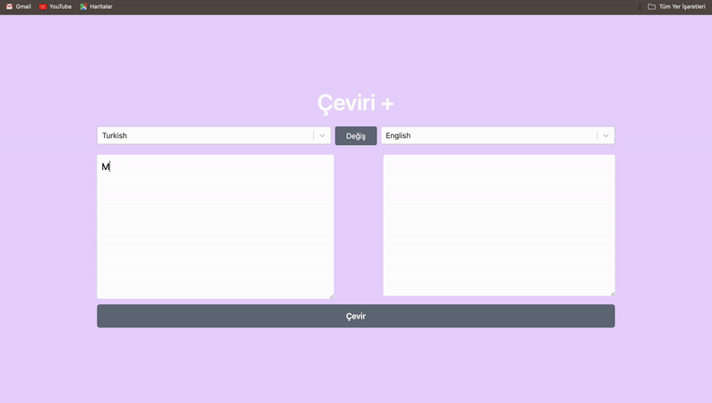

<h1>Translate Toolkit App</h1>

- React
- React Redux
- Redux Toolkit
- Axios
- React Select

<h2>About The Project</h2>
Users can translate the text in any language they want and change the language of the text to another language.They can quickly access the language they want with filters.

